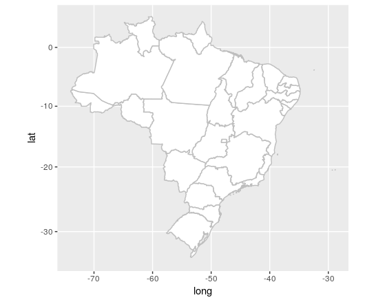

## Mapa do brasil com divisão de estados em R

Arquivos shapefile retirados do [site do IBGE](ftp://geoftp.ibge.gov.br/organizacao_do_territorio/malhas_territoriais/malhas_municipais/municipio_2015/Brasil/BR/br_unidades_da_federacao.zip).